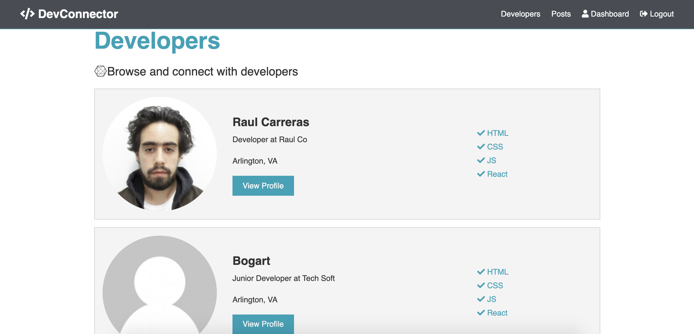
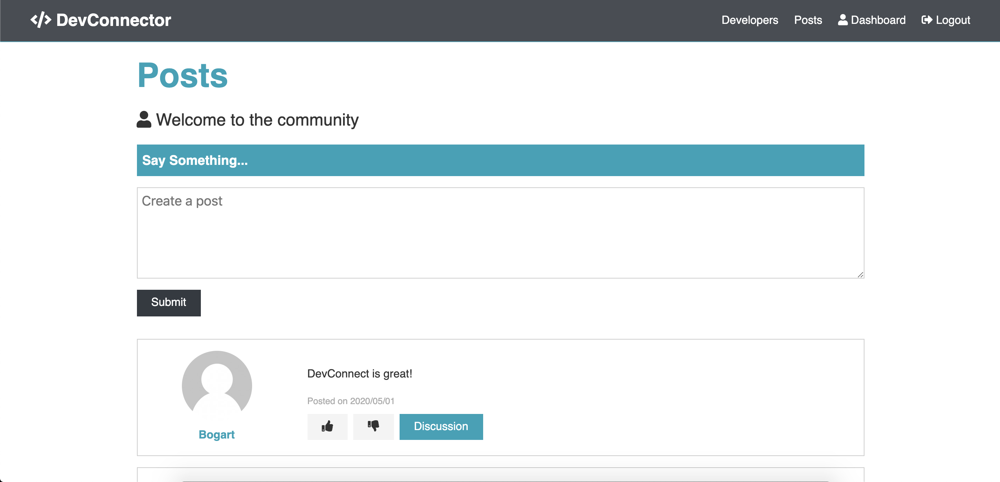
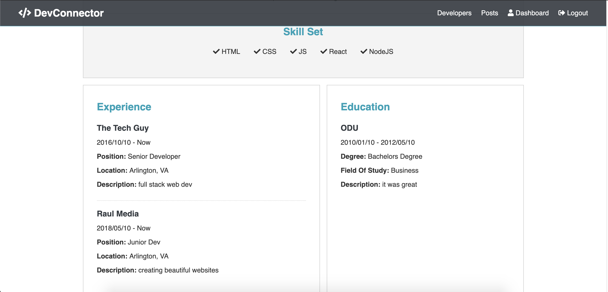

# DevConnector - Back End
Server side of React DevConnector Client. Contains functions to enable CRUD operations for client side application.

Visit the live site here: https://dev-connect-client.now.sh/

---

## Technologies Used
- Node
- Express Framework
- Passport Authentification
- Jwt Security
- Helmet

---

## Functionality

Users

```    
    name: {
        type: String,
        required: true
    },
    email: {
        type: String,
        required: true,
        unique: true
    },
    password: {
        type: String,
        required: true,
    },
    avatar: {
        type: String
    },
    date: {
        type: Date,
        default: Date.now
    }
```

---
## Screenshots

### Landing


### Developers


### Dashboard Page


### Posts Page


### Profile Page


